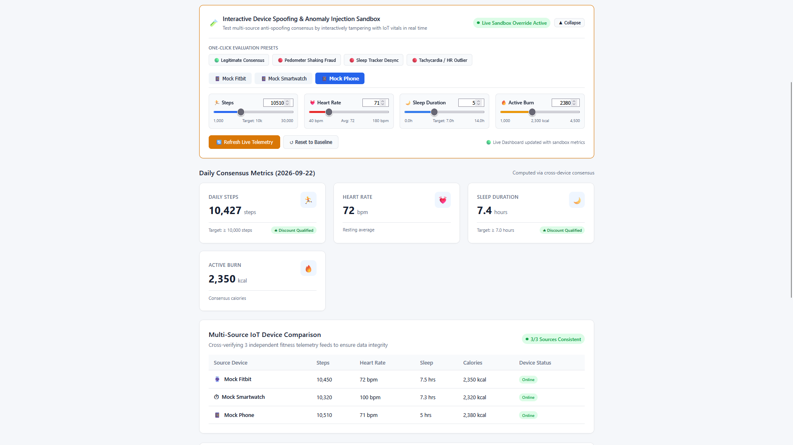
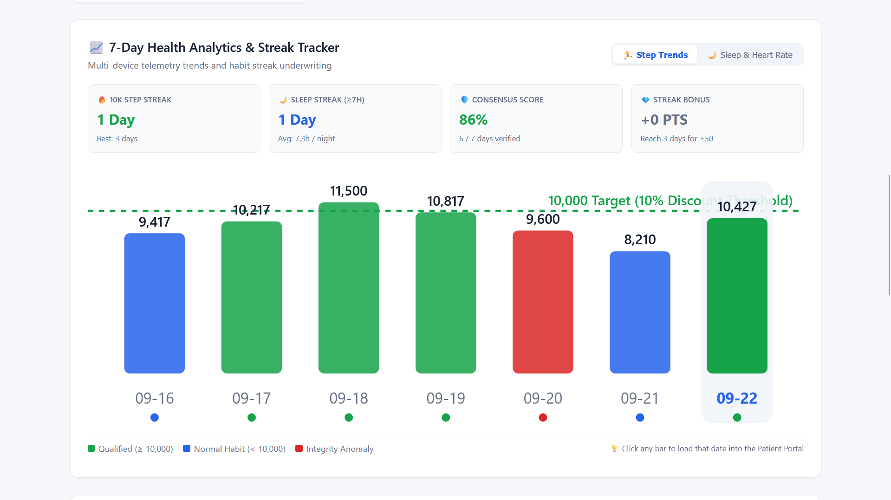
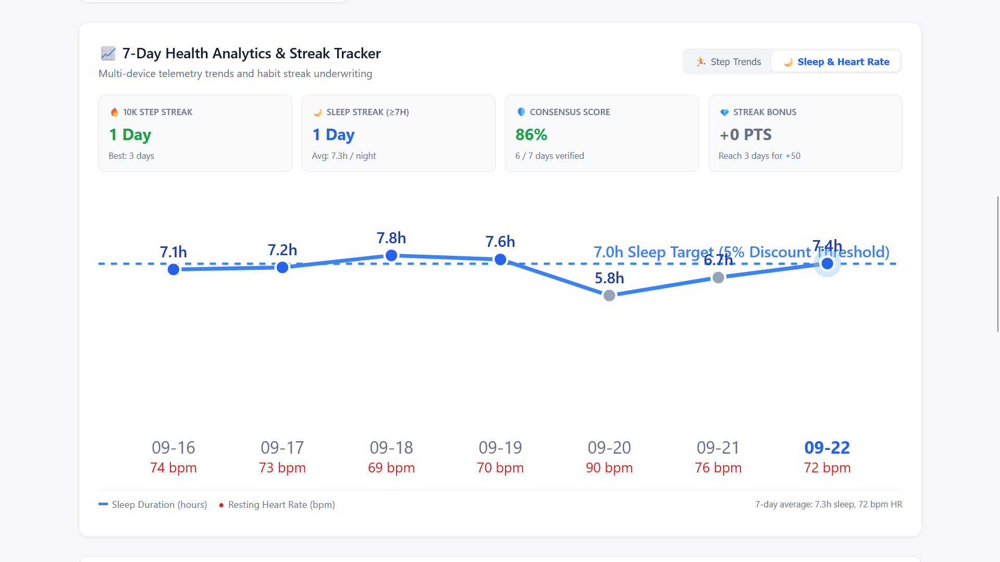

# Health-Chain 🏥⛓️
> **Decentralized, Privacy-Preserving Health Data Validation & Dynamic Insurance Platform**


---

## Table of Contents
1. [Executive Summary & Problem Statement](#executive-summary--problem-statement)
2. [Core Architecture & Privacy Invariants](#core-architecture--privacy-invariants)
3. [Visual Tour & System Screenshots](#visual-tour--system-screenshots)
   - [1. Patient Portal — Multi-Device Telemetry Consensus](#1-patient-portal--multi-device-telemetry-consensus)
   - [2. Patient Portal — Cryptographic Proof & On-Chain Consent](#2-patient-portal--cryptographic-proof--on-chain-consent)
   - [3. Anti-Spoofing — Anomaly Detection Banner](#3-anti-spoofing--anomaly-detection-banner)
   - [4. Integrity Enforcement — Blocked On-Chain Commit](#4-integrity-enforcement--blocked-on-chain-commit)
   - [5. Insurer Portal — Consent Filter & Dynamic Premium](#5-insurer-portal--consent-filter--dynamic-premium)
   - [6. Claims Submission Modal](#6-claims-submission-modal)
   - [7. Policy Claims Adjudication & Audit Trail](#7-policy-claims-adjudication--audit-trail)
   - [8. Interactive Device Spoofing & Anomaly Injection Sandbox](#8-interactive-device-spoofing--anomaly-injection-sandbox)
   - [9. 7-Day Historical Analytics & Streak Tracker](#9-7-day-historical-analytics--streak-tracker)
4. [Feature Guide: What You See on the Screen](#feature-guide-what-you-see-on-the-screen)
5. [Prerequisites & Windows Setup Notice](#prerequisites--windows-setup-notice)
6. [Quickstart: How to Run the Project](#quickstart-how-to-run-the-project)
7. [12-Step Evaluation & Presentation Walkthrough](#12-step-evaluation--presentation-walkthrough)
8. [Automated Testing Suite (70 Tests)](#automated-testing-suite)
9. [Complete REST API Reference](#complete-rest-api-reference)
10. [Troubleshooting & FAQs](#troubleshooting--faqs)
11. [Repository Structure](#repository-structure)

---

## Executive Summary & Problem Statement

Traditional healthcare and health insurance suffer from four critical challenges:

1. **Medical Privacy Violations**: Storing raw patient biometrics in centralized databases or on public blockchains creates severe data-leak risks and violates privacy laws (GDPR, HIPAA).
2. **Fitness Tracking Fraud**: When insurers reward policyholders for daily steps, users can easily spoof pedometers (e.g., shaking an isolated fitness band) to game discounts.
3. **Lack of Patient Sovereignty**: Patients have zero cryptographic control over which third parties, underwriters, or hospitals view their records.
4. **Static, Unfair Premiums**: Policyholders pay uniform high premiums regardless of their verified daily preventative wellness habits.

### The Health-Chain Solution
Health-Chain introduces an academic and industrial MVP proving how **off-chain multi-source consensus**, **deterministic SHA-256 cryptographic hashing**, and **Ethereum smart contracts** solve all four issues simultaneously:
- **Zero Raw Data On-Chain**: Raw vitals remain off-chain; only 64-character SHA-256 digests are committed to Ethereum.
- **Anti-Spoofing Cross-Verification**: Telemetry from 3 independent sources (*Fitbit, Smartwatch, Phone*) is evaluated using statistical tolerance thresholds (±10% steps, ±1.0h sleep) before hashing.
- **Smart Contract Access Control**: Insurers are blocked from viewing patient data until the patient explicitly signs an on-chain consent transaction.
- **Automated Dynamic Underwriting**: The Solidity contract evaluates verified wellness milestones to dynamically discount annual premiums (up to 15% savings) and distribute idempotent wellness tokens.

---

## Core Architecture & Privacy Invariants

```text
┌───────────────────────────────────────────────────────────────────────────┐
│                       USER INTERFACE (React 18 + Vite)                    │
│   • Patient Portal: Vitals, Consensus Status, On-Chain Recording, Rewards │
│   • Insurer Portal: Consent Filter, Smart Premium Underwriting, Claims    │
└───────────────────────────────────┬───────────────────────────────────────┘
                                    │
                                    │  HTTP REST API (Proxy: localhost:3000 → 5000)
                                    │
┌───────────────────────────────────▼───────────────────────────────────────┐
│                    BACKEND APPLICATION (Node.js + Express)                │
│   • Multi-Source Data Ingestion (Fitbit, Smartwatch, Phone)               │
│   • Statistical Tolerance Engine (Anomaly & Tamper Detection)             │
│   • Deterministic Canonical Serializer & SHA-256 Hasher                   │
│   • Local Claims Store & In-Memory State Cache                            │
└───────────────────────────────────┬───────────────────────────────────────┘
                                    │
                                    │  Ethers.js v6 JSON-RPC (localhost:8545)
                                    │
┌───────────────────────────────────▼───────────────────────────────────────┐
│                 ETHEREUM SMART CONTRACT (Solidity 0.8.24)                 │
│   • HealthRecordHashes: Canonical digest ledger                           │
│   • ConsentManagement: Patient-directed entity permissions                │
│   • PremiumRules: Dynamic mathematical discount formula                   │
│   • ClaimsLifecycle: Transparent State Machine (Pending/Approved/Reject)  │
│   • WellnessRewards: Idempotent point minting (prevents double-claims)    │
└───────────────────────────────────────────────────────────────────────────┘
```

### The 4 Architectural Invariants
1. **The Privacy Invariant**: Raw medical measurements (steps, heart rate, sleep duration, calories) **NEVER** touch Ethereum. Only the deterministic SHA-256 hash of the canonical JSON record is saved on-chain.
2. **The Integrity Invariant**: If telemetry from any wearable device exceeds statistical tolerance limits (e.g. outlier steps), the backend classifies the day as an **Integrity Anomaly** and **strictly forbids** writing to the blockchain.
3. **The Consent Invariant**: An insurer cannot query a patient's policy or records unless `hasConsent(patientId, insurerAddress)` returns `true` on the smart contract.
4. **The Idempotency Invariant**: Wellness rewards use a deterministic key (`keccak256(patientId, date)`) ensuring a patient can only claim rewards once per valid calendar date.

---

## Visual Tour & System Screenshots

This section presents the actual running application interfaces captured across the end-to-end user flows, detailing what each view represents, its underlying cryptographic mechanism, and its purpose in the architecture.

---

### 1. Patient Portal — Multi-Device Telemetry Consensus


- **What You See**:
  - The top section of the **Patient Portal** for policyholder `P001` (*Aarav Sharma*) on date `2026-09-22`.
  - **Daily Consensus Metrics**: Verified multi-source averages displaying **10,427 steps** (with a green *"Discount Qualified"* milestone badge), **72 bpm resting heart rate** (*Normal*), **7.4h sleep duration** (*Discount Qualified*), and **2,350 kcal** active burn.
  - **Multi-Source IoT Device Breakdown**: A green *"3/3 Sources Consistent"* badge verifying telemetry from three independent devices:
    - **Mock Fitbit**: 10,450 steps, 71 bpm, 7.5h sleep
    - **Mock Smartwatch**: 10,380 steps, 73 bpm, 7.3h sleep
    - **Mock Phone**: 10,450 steps, 72 bpm, 7.4h sleep
- **Under the Hood**:
  - The backend statistical tolerance engine collects telemetry from independent IoT inputs and cross-evaluates them:
    $$\text{Tolerance: } \pm10\% \text{ for steps, } \pm1.0\text{h for sleep duration}$$
  - Because discrepancies are $< 1\%$, the engine synthesizes an arithmetic consensus mean and serializes the dataset into deterministic canonical JSON keys.
- **Why It Matters**:
  - **Eliminates Single-Point Vulnerability**: A single malfunctioning tracker or rogue phone cannot distort verified health habits.

---

### 2. Patient Portal — Cryptographic Proof & On-Chain Consent


- **What You See**:
  - The bottom section of the **Patient Portal** on a valid day (`2026-09-22`).
  - **Cryptographic Proof Card**: The 64-character deterministic SHA-256 digest (`09c687ad04838b9d3ff07aa8ce833ff32943eb9c5950d405fb559779df3ce33a`) confirmed with green status **"Committed to Blockchain (Block #2)"**.
  - **Smart Contract Access Consent Card**: Displays active authorization for insurer address `0x70997970C51812dc3A010C7d01b50e0d17dc79C8` with status **"Access Granted"** and an on-demand **"Revoke Consent"** button.
  - **Wellness Rewards & Points Widget**: Confirms **150 PTS** awarded with status **"Claimed On-Chain"**.
- **Under the Hood**:
  - **The Privacy Invariant**: The SHA-256 digest is generated off-chain. The `recordDailyConsensus(patientId, date, hash)` method commits only this 32-byte digest to Ethereum. **No personal biometrics touch the public ledger.**
  - **The Consent Invariant**: Access permission is written directly to the `consents[patientId][insurer]` mapping in Solidity.
  - **The Idempotency Invariant**: Rewards are keyed to `keccak256(abi.encodePacked(patientId, date))`, ensuring wellness points can only be minted once per calendar day.
- **Why It Matters**:
  - Delivers full HIPAA & GDPR compliance with cryptographic integrity proofs while giving patients absolute sovereignty to revoke insurer access at will.

---

### 3. Anti-Spoofing — Anomaly Detection Banner


- **What You See**:
  - The Patient Portal after selecting date `2026-09-20 (Anomaly)`.
  - A prominent red warning banner: **"⚠️ Integrity Anomaly Detected — Not eligible for on-chain recording"**.
  - Detailed mathematical diagnosis: *"Step discrepancy across devices exceeds tolerance (Mock Fitbit: 14,200 vs Mock Phone: 5,925, max discrepancy 139.6% > allowed 10.0%)"*.
  - Device breakdown table showing that the Fitbit tracked 14,200 steps while the Phone only tracked 5,925 steps.
- **Under the Hood**:
  - The cross-validation engine computes the relative discrepancy across reporting devices:
    $$\text{Discrepancy} = \frac{\max(\text{steps}) - \min(\text{steps})}{\min(\text{steps})} = \frac{14,200 - 5,925}{5,925} = 139.66\%$$
  - Since $139.66\% \gg 10.0\%$, the statistical tolerance engine flags the record as invalid (`valid: false`).
- **Why It Matters**:
  - **Defeats Pedometer Shaking Fraud**: Policyholders cannot artificially inflate steps on an isolated wristband while their phone sits stationary to fraudulently obtain discounts.

---

### 4. Integrity Enforcement — Blocked On-Chain Commit


- **What You See**:
  - The bottom section of the Patient Portal for the anomalous date (`2026-09-20`).
  - **Cryptographic Proof Card**: The SHA-256 hash is computed for local audit verification, but its status is marked **"Rejected (Integrity Anomaly)"**.
  - The submission button is disabled and locked: **"Cannot Record — Integrity Anomaly Detected"**.
  - **Wellness Rewards Card**: Balance displays **0 PTS** with notice *"Not Eligible — Integrity Anomaly Detected"*, and the claim button is disabled.
- **Under the Hood**:
  - **The Integrity Invariant**: The backend endpoint `/api/health/:patientId/record` validates data integrity prior to invoking Ethers.js. When discrepancy exceeds tolerance, it rejects the request with HTTP 400.
  - No Ethereum gas is spent, and the unverified digest is strictly prevented from entering the smart contract ledger.
- **Why It Matters**:
  - Protects the blockchain state from pollution by corrupted or spoofed data, ensuring insurance underwriters can trust every hash stored on-chain.

---

### 5. Insurer Portal — Consent Filter & Dynamic Premium


- **What You See**:
  - The **Insurer Portal** view (`http://localhost:3000` $\rightarrow$ *"Insurer Portal"*).
  - **Authorized Consenting Patients**: Dropdown displays only `P001: Aarav Sharma`. Other patients (`P002`, `P003`) are omitted because they have not granted on-chain consent.
  - **Smart Contract Dynamic Premium Underwriting**:
    - Policy: `POL-001` (Comprehensive Health Plus)
    - Base Annual Premium: **₹10,000**
    - Verified Step Milestone ($\ge$ 10,000 steps): **-10% (-₹1,000)**
    - Verified Sleep Milestone ($\ge$ 7.0h sleep): **-5% (-₹500)**
    - Total Discount Applied: **15% (-₹1,500)**
    - **Final Dynamic Premium**: **₹8,500**
  - **Policy Claims Table**: Displays pending reimbursement claim `CLM-1001` (₹4,000) with `[Approve]` and `[Reject]` action buttons.
- **Under the Hood**:
  - The backend route `/api/insurance/authorized-patients` filters records by executing `hasConsent(patientId, insurerAddress)` on the smart contract.
  - The dynamic premium formula computes discounts based on validated milestone thresholds committed on-chain.
- **Why It Matters**:
  - Guarantees that insurers cannot spy on non-consenting users and transforms insurance from static, opaque pricing into transparent, algorithmically discounted premiums.

---

### 6. Claims Submission Modal


- **What You See**:
  - The modal dialog triggered by clicking **"+ New Claim"**.
  - Form Fields:
    - **Patient**: `Aarav Sharma (P001)`
    - **Policy ID**: `POL-001`
    - **Claim Amount (₹)**: `4000`
    - **Medical Description**: *"Diagnostic lab panel and specialist consult"*
  - Action Buttons: *"Cancel"* and *"Submit Claim to Blockchain"*.
- **Under the Hood**:
  - Submitting sends a `POST` request to `/api/claims`.
  - The backend initiates an on-chain transaction calling `submitClaim(claimId, policyId, patientId, amount, description)` on `HealthChain.sol`.
  - The contract initializes the claim with state `ClaimStatus.Pending` and broadcasts an immutable `ClaimSubmitted` event on Ethereum.
- **Why It Matters**:
  - Replaces paper trails and opaque insurance backoffices with an immutable, transparent on-chain filing timestamp.

---

### 7. Policy Claims Adjudication & Audit Trail


- **What You See**:
  - The resolved insurance claims audit table in the Insurer Portal.
  - **Approved Claim**: `CLM-1001` | Aarav Sharma | ₹4,000 | Diagnostic lab panel and specialist consult | Status: **Approved** (Green Badge) | Note: *"Verified under preventative care benefits"*.
  - **Rejected Claim**: `CLM-6053` | Aarav Sharma | ₹15,000 | Unapproved elective cosmetic consultation | Status: **Rejected** (Red Badge) | Note: *"Claim documentation does not satisfy policy guidelines"*.
- **Under the Hood**:
  - Adjudicator decisions execute `approveClaim(claimId, reason)` or `rejectClaim(claimId, reason)` on the smart contract.
  - The contract transitions claim state (`Pending` $\rightarrow$ `Approved` or `Rejected`) and emits `ClaimApproved` or `ClaimRejected` events containing the mandatory explanation reason.
- **Why It Matters**:
  - Protects policyholders against arbitrary, unexplained rejections by binding every insurer decision and reason to an immutable distributed ledger.

---

### 8. Interactive Device Spoofing & Anomaly Injection Sandbox


- **What You See**:
  - The **Interactive Anomaly Sandbox** expanded at the top of the Patient Portal with active status badge **"Live Sandbox Override Active"**.
  - **One-Click Evaluation Presets**: Quick-test buttons for:
    - 🟢 *Legitimate Consensus* (within <1% tolerance)
    - 🔴 *Pedometer Shaking Fraud* (Fitbit shaken to 24,000 steps vs phone 8,100)
    - 🔴 *Sleep Tracker Desync* (Watch 8.0h vs phone 2.5h)
    - 🔴 *Tachycardia / HR Outlier* (Watch 145 bpm vs Fitbit 70 bpm)
  - **Fine-Grained IoT Device Controls**: Tabs for *Mock Fitbit*, *Mock Smartwatch*, and *Mock Phone* with real-time numeric inputs and sliders for Steps, Heart Rate, Sleep Duration, and Active Calories.
  - **Live Dynamic Synchronization**: Buttons for **"Refresh Live Telemetry"** and **"Reset to Baseline"**, with status confirming that the active portal consensus metrics and device breakdown table are dynamically driven by sandbox values.
- **Under the Hood**:
  - Adjusting any slider or preset immediately triggers a simulation via [`POST /api/health/simulate-validation`](file:///d:/Github/Health-Chain/backend/src/app.js).
  - The statistical tolerance engine verifies cross-device divergence in-memory ($\pm10\%$ steps, $\pm10$ bpm HR, $\pm1.0\text{h}$ sleep) without altering on-disk files.
  - When anti-spoofing thresholds are breached, the UI immediately locks the **"Record Hash on Blockchain"** button and displays the **Integrity Invariant** alert.
- **Why It Matters**:
  - Grants evaluators, hackathon judges, and instructors an interactive, hands-on testing environment to tamper with wearable data in real time and observe anti-fraud defenses react dynamically.

---

### 9. 7-Day Historical Analytics & Streak Tracker

#### A. Step Volume Trends & 10k Milestone Underwriting


- **What You See**:
  - The **7-Day Health Analytics & Streak Tracker** module for policyholder `P001` (*Aarav Sharma*).
  - **4 Habit Consistency Badges**:
    - **🔥 10k Step Streak**: `1 Day` (Historical Best: `3 days` on Sep 17–19).
    - **🌙 Sleep Streak (≥7h)**: `1 Day` (7-Day Average: `7.3h / night`).
    - **🛡️ Consensus Score**: `86%` (`6 / 7 days verified` across all 3 devices; Sep 20 flagged as anomaly).
    - **💎 Streak Bonus**: `+0 PTS` (Next milestone prompt: *"Reach 3 days for +50"*).
  - **Interactive Step Volume SVG Chart**:
    - Green dashed horizontal benchmark at **10,000 Target (10% Discount Threshold)**.
    - Daily volume bars: `09-16` (9,417 — Blue), `09-17` (10,217 — Green), `09-18` (11,500 — Green), `09-19` (10,817 — Green), `09-20` (9,600 — Red Anomaly), `09-21` (8,210 — Blue), and `09-22` (10,427 — Green, selected).
    - Interactive date switching: clicking any day bar immediately switches the Patient Portal to that date's telemetry.
- **Under the Hood**:
  - Aggregated via [`GET /api/health/:patientId/history`](file:///d:/Github/Health-Chain/backend/src/app.js) and calculated by [`backend/src/history.js`](file:///d:/Github/Health-Chain/backend/src/history.js).
  - Applies deterministic streak bonus tiers (+50 PTS for 3-day streak, +100 PTS for 5-day streak, +150 PTS for 7-day streak).
- **Why It Matters**:
  - Shifts insurance wellness from isolated single-day checkpoints to sustained habit consistency, rewarding policyholders for long-term health behavior.

#### B. Sleep Duration & Resting Heart Rate Correlation


- **What You See**:
  - The **"Sleep & Heart Rate"** tab within the Historical Analytics module.
  - **Sleep Trend Curve**: A blue polyline plotting daily restorative sleep against the horizontal dashed benchmark line at **7.0h Sleep Target (5% Discount Threshold)**.
  - **Dual-Metric Alignment**: Nightly sleep duration labeled above each node (7.1h, 7.2h, 7.8h, 7.6h, 5.8h, 6.7h, 7.4h) with corresponding daily resting heart rate in red bpm beneath each date (74 bpm, 73 bpm, 69 bpm, 70 bpm, 90 bpm, 76 bpm, 72 bpm).
  - **Footer Summary**: Confirms a 7-day average of `7.3h sleep` and `72 bpm HR`.
- **Under the Hood**:
  - Dual-metric coordinate projection rendered with native SVG for zero external library weight.
  - Exposes clinical correlation: on anomalous day `09-20`, poor sleep (5.8h) directly correlates with elevated resting heart rate (90 bpm).
- **Why It Matters**:
  - Proves the holistic diagnostic value of cross-referencing circadian recovery with cardiovascular stress for preventative underwriting.

---

## Feature Guide: What You See on the Screen

### Patient Portal (`http://localhost:3000`)

| UI Element | What It Represents | Real-World Purpose |
| :--- | :--- | :--- |
| **Demo Patient Selector** | Switch between `P001` (Aarav Sharma), `P002` (Priya Patel), and `P003` (Rohan Verma). | Simulates different policyholders with varying health metrics and wallet addresses. |
| **Date Switcher** | Select between 7 calendar days (`2026-09-16` through `2026-09-22`). | Demonstrates consistent days, historical streaks, and deliberate anti-fraud anomaly test days. |
| **Interactive Anomaly Sandbox** | Collapsible testing panel with device sliders and 1-click fraud presets. | Enables live anti-spoofing demonstrations by dynamically testing tolerance breaches. |
| **Daily Consensus Metrics** | Displays verified daily averages (e.g., 10,427 steps, 7.4h sleep). | Aggregated view synthesized across all active wearable devices. |
| **7-Day Health Analytics & Streaks** | Interactive SVG charts for steps, sleep, and heart rate with streak counters. | Visualizes habit consistency, tracks 10k step streaks, and calculates wellness bonuses. |
| **IoT Device Comparison Table** | Shows raw telemetry side-by-side: *Mock Fitbit*, *Mock Smartwatch*, *Mock Phone*. | Proves cross-device verification. If one device is spoofed or hacked, the discrepancy is exposed immediately. |
| **Integrity Anomaly Banner** | Bright red alert showing discrepancy percentages. | Demonstrates automated rejection of tampered fitness tracking data. |
| **Blockchain Cryptographic Proof** | Shows the 64-character canonical SHA-256 digest with **"Record Hash on Blockchain"** button. | Creates an immutable cryptographic proof on Ethereum without exposing private medical details. |
| **Smart Contract Access Consent** | Toggle button allowing the patient to **Grant** or **Revoke** insurer access on-chain. | Restores data sovereignty to the patient. Access is enforced by smart contract logic, not central servers. |
| **Wellness Rewards & Points** | Interactive widget showing total points and a **"Claim Points"** button. | Motivates preventative healthy habits with automated points that prevent duplicate claims. |

---

### Insurer Portal (`http://localhost:3000` -> Click "Insurer Portal" Top-Right)

| UI Element | What It Represents | Real-World Purpose |
| :--- | :--- | :--- |
| **Authorized Consenting Patients** | Dropdown listing only policyholders who granted active on-chain consent. | Insurers cannot view non-consenting patients (`P002` and `P003` are hidden until authorized). |
| **Smart Contract Premium Calculation** | Live underwriting card showing base premium (₹10,000) discounted to **₹8,500**. | Evaluates on-chain verified activity: -10% for steps $\ge$ 10,000 and -5% for sleep $\ge$ 7 hours. |
| **Policy Claims Adjudication Table** | Audit table showing claim ID, patient, amount, description, status, and action buttons. | Provides a transparent, tamper-proof audit trail for medical insurance reimbursement. |
| **"Submit New Claim" Modal** | Pop-up form enabling patients or clinics to submit reimbursement requests. | Adds claims with `Pending` status and broadcasts a `ClaimSubmitted` event on Ethereum. |
| **Approve / Reject Buttons** | Adjudicator actions requiring documented decision rationale. | Transitions claim status on-chain to `Approved` or `Rejected` with an immutable audit note. |

---

## Prerequisites & Windows Setup Notice

- **Node.js**: v18.x, v20.x, or v24.x installed.
- **npm**: v9.x or higher installed.

### Windows PowerShell Notice
On Windows, PowerShell restricts the execution of `.ps1` scripts by default. If typing `npm` or `npx` gives a red security error:
- **Solution A**: Use **`npm.cmd`** and **`npx.cmd`** in PowerShell.
- **Solution B**: Open standard **Command Prompt (`cmd.exe`)** or **Git Bash**, where standard `npm` and `npx` work without restrictions.
- **Solution C**: Run `Set-ExecutionPolicy RemoteSigned -Scope CurrentUser` in PowerShell once as Administrator.

---

## Quickstart: How to Run the Project

Follow these steps to launch the entire platform from scratch with a local Ethereum blockchain:

### Step 1: Install Dependencies (One-Time Setup)
Open your terminal in the root folder (`c:\Users\priya\Downloads\blockchain`):

```powershell
# 1. Install Blockchain dependencies
cd blockchain
npm.cmd install

# 2. Install Backend dependencies
cd ..\backend
npm.cmd install

# 3. Install Frontend dependencies
cd ..\frontend
npm.cmd install

# Return to root directory
cd ..
```

---

### Step 2: Start the System (4 Terminals)

Open **4 separate terminal windows or tabs** and run one command in each:

#### Terminal 1: Start Local Ethereum Node
```powershell
cd blockchain
npx.cmd hardhat node
```
*Starts a local JSON-RPC Ethereum blockchain at `http://127.0.0.1:8545` with 20 pre-funded test accounts.*

#### Terminal 2: Deploy Smart Contract
```powershell
cd blockchain
npx.cmd hardhat run scripts/deploy.cjs --network localhost
```
*Deploys `HealthChain.sol` and automatically exports the contract address (`0x5FbDB...`) and ABI to `backend/src/config/contractConfig.json`.*

#### Terminal 3: Start Backend API Server
```powershell
cd backend
npm.cmd start
```
*Starts the Express REST API server listening on **http://localhost:5000**.*

#### Terminal 4: Start Frontend Dev Server
```powershell
cd frontend
npm.cmd run dev
```
*Starts the Vite React dev server on **http://localhost:3000**.*

---

### Step 3: Open in Browser
Visit **[http://localhost:3000](http://localhost:3000)** in Google Chrome, Microsoft Edge, or Firefox.

---

## 12-Step Evaluation & Presentation Walkthrough

Use this sequential 12-step flow when presenting the project for an evaluation or demonstration:

1. **Select Patient**: Select `P001` (*Aarav Sharma*) on date `2026-09-22`.
2. **Review IoT Consensus**: Observe that all 3 sources (*Mock Fitbit*, *Mock Smartwatch*, *Mock Phone*) agree within 10% tolerance $\rightarrow$ Green badge **"3/3 Sources Consistent"**.
3. **Demonstrate Anti-Spoofing Anomaly**: Switch date pill to `2026-09-20 (Anomaly)`. Show that the red banner highlights a 139.6% step discrepancy and blocks on-chain commitment.
4. **Return to Valid Day**: Switch back to `2026-09-22`.
5. **Record Hash On-Chain**: Click **"Record Hash on Blockchain"**. Observe the confirmed transaction hash and block number written to Ethereum.
6. **Grant Insurance Consent**: In the Smart Contract Access Consent card, click **"Grant Consent"**.
7. **Switch to Insurer Portal**: Click the **"Insurer Portal"** button in the header.
8. **Verify Access Control**: Note that only `P001: Aarav Sharma` appears in the authorized list; unconsented patients are completely hidden.
9. **Show Dynamic Premium Underwriting**: Point out the live discount calculation:
   - Base Premium: ₹10,000
   - 10,427 steps logged ($\ge$ 10,000): **-10% (-₹1,000)**
   - 7.4h sleep logged ($\ge$ 7.0h): **-5% (-₹500)**
   - **Final Dynamic Premium**: **₹8,500 (15% savings)**.
10. **Submit Reimbursement Claim**: Click **"+ New Claim"**. Enter Amount `4000` and Description `Diagnostic lab panel and specialist consult`.
11. **Adjudicate Claim**: In the claims table, click **"Approve"** (enter reason `Verified under preventative care benefits`). Observe status change to `Approved`.
12. **Claim Wellness Points**: Switch back to **Patient Portal**. Click **"Claim +150 Points"**. Note that points are awarded and the contract prevents duplicate claims for the same date.

---

## Automated Testing Suite

The repository features comprehensive automated test coverage across all architectural tiers:

### Run All 70 Tests from Root (One Command)
```powershell
npm.cmd test
```
*Executes both the Hardhat smart contract test suite and backend E2E integration test suite sequentially in ~4 seconds.*

### Run Subsystem Tests Independently
```powershell
# Run 18 Hardhat Smart Contract Unit Tests
cd blockchain
npx.cmd hardhat test

# Run 52 Backend Unit, Integration, History & Anomaly Sandbox Tests
cd backend
npm.cmd test

# Build Frontend Production Bundle
cd frontend
npm.cmd run build
```

---

## Complete REST API Reference

The backend runs on `http://localhost:5000` (and is proxied transparently by Vite from `http://localhost:3000/api`):

| Endpoint | Method | Parameters | Description |
| :--- | :---: | :--- | :--- |
| `/api/health` | `GET` | — | System heartbeat and operational status |
| `/api/patients` | `GET` | — | Retrieve list of all demo patients (`P001`, `P002`, `P003`) |
| `/api/patients/:patientId` | `GET` | `patientId` | Retrieve single patient profile details |
| `/api/health/:patientId` | `GET` | `patientId`, `date?` | Retrieve patient health telemetry records |
| `/api/health/:patientId/sources` | `GET` | `patientId`, `date?` | Retrieve multi-source breakdown grouped by wearable device |
| `/api/health/:patientId/validation` | `GET` | `patientId`, `date?` | Perform statistical tolerance checks and compute SHA-256 hash |
| `/api/health/simulate-validation` | `POST` | `{ sources, tolerances?, patientId?, date? }` | Interactive Sandbox: simulate arbitrary IoT vitals & anti-spoofing |
| `/api/health/:patientId/history` | `GET` | `patientId` | 7-day health trend analytics, habit streaks, and consensus integrity |
| `/api/health/:patientId/record` | `POST` | `patientId`, `{ date }` | Validate telemetry and commit SHA-256 hash to blockchain |
| `/api/health/:patientId/record-onchain`| `GET` | `patientId`, `date` | Query on-chain health record digest and timestamp |
| `/api/consent` | `POST` | `{ patientId, entityAddress, granted }` | Grant or revoke entity access consent on smart contract |
| `/api/consent/:patientId` | `GET` | `patientId`, `entity` | Query whether an insurer address currently has consent |
| `/api/insurance/authorized-patients` | `GET` | `entity?` | Filter patients who have granted active on-chain consent |
| `/api/policies/:patientId` | `GET` | `patientId` | Retrieve policy and calculate live dynamic discounted premium |
| `/api/claims` | `GET` | — | Retrieve all insurance claims |
| `/api/claims/:patientId` | `GET` | `patientId` | Retrieve claims filtered by patient |
| `/api/claims` | `POST` | `{ policyId, patientId, amount, description }` | Submit a new claim and broadcast to blockchain |
| `/api/claims/:claimId/approve` | `POST` | `claimId`, `{ reason }` | Approve insurance claim on-chain |
| `/api/claims/:claimId/reject` | `POST` | `claimId`, `{ reason }` | Reject insurance claim on-chain |
| `/api/rewards/:patientId` | `GET` | `patientId` | Query total accumulated wellness reward points |
| `/api/rewards/:patientId/status` | `GET` | `patientId`, `date` | Check daily reward eligibility and on-chain claim status |
| `/api/rewards/:patientId/claim` | `POST` | `patientId`, `{ date }` | Award daily wellness reward points on Ethereum |
| `/api/blockchain/info` | `GET` | — | Retrieve blockchain connection info and contract address |

---

## Troubleshooting & FAQs

#### Q1: Why does PowerShell say `npm.ps1 cannot be loaded`?
**A**: Windows PowerShell execution policy restricts script execution. Use `npm.cmd` and `npx.cmd` instead, or run Command Prompt (`cmd.exe`).

#### Q2: What port does each service run on?
- **Hardhat Blockchain Node**: `http://127.0.0.1:8545`
- **Express Backend API**: `http://localhost:5000`
- **React Frontend UI**: `http://localhost:3000`

#### Q3: Why is my patient hidden in the Insurer Portal?
**A**: This is intentional! The insurer portal strictly queries `hasConsent()` on the smart contract. Go to the **Patient Portal**, choose that patient, and click **"Grant Consent"**. Return to the Insurer Portal and the patient will immediately appear.

#### Q4: Why can't I record data for `2026-09-20` on the blockchain?
**A**: `2026-09-20` has a deliberate discrepancy (one wearable logged an outlier). Health-Chain strictly rejects committing unvalidated or inconsistent data to protect blockchain data integrity.

---

## Repository Structure

```text
blockchain/
├── backend/                              # Express REST API
│   ├── src/
│   │   ├── app.js                        # API routes & endpoint definitions
│   │   ├── server.js                     # HTTP server entry (port 5000)
│   │   ├── blockchainService.js          # Ethers.js v6 smart contract service wrapper
│   │   ├── dataLoader.js                 # File access & mock data store
│   │   ├── validation.js                 # Tolerance engine & SHA-256 canonical hasher
│   │   ├── rewards.js                    # Daily wellness reward calculation engine
│   │   └── config/contractConfig.json    # Deployed contract address & ABI
│   └── test/                             # 44 automated backend & E2E tests
├── blockchain/                           # Hardhat Ethereum Workspace
│   ├── contracts/
│   │   └── HealthChain.sol               # Core Solidity smart contract
│   ├── scripts/
│   │   └── deploy.cjs                    # Contract deployment script & ABI exporter
│   ├── test/                             # 18 Hardhat/Chai unit tests
│   └── hardhat.config.cjs                # Hardhat configuration (Solidity 0.8.24)
├── frontend/                             # React 18 + Vite Single Page App
│   ├── src/
│   │   ├── components/                   # UI components (Metrics, Claims, Consent, Rewards)
│   │   ├── App.jsx                       # Dual-role portal switcher & layout
│   │   └── index.css                     # Custom responsive dark-mode styling
│   └── vite.config.js                    # Vite dev server configuration (port 3000)
├── data/                                 # Seed datasets
│   ├── patients.json                     # Demo patient profiles (P001, P002, P003)
│   ├── health-records.json               # Multi-device IoT records (Fitbit, Smartwatch, Phone)
│   ├── policies.json                     # Health insurance policy definitions
│   └── claims.json                       # Insurance reimbursement claims
├── screenshots/                          # Visual tour & evaluation walkthrough captures
└── context/                              # Architectural specification docs
```

---

## License

This project is licensed under the **MIT License** — free and open for educational and evaluation purposes.
